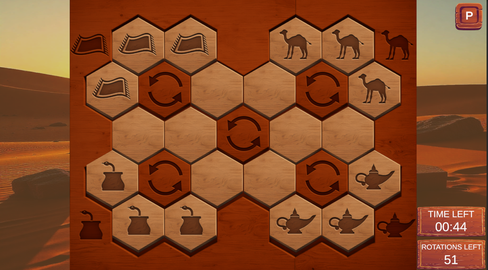

# 🧩 PuzzlesThreeRules

**PuzzlesThreeRules** is a challenging puzzle game built in Unity. Strategy and speed are key to mastering the three core rules! Test your skills by solving puzzles under time and rotation constraints while following a specific order.

## 🚀 How to Install

1. Clone this repository
2. Open the project in **Unity** (version 6.0.54f1).
3. Open all scenes in the **Scene** folder to load them. **IMPORTANT STEP!!!**
4. Open the **Loading scene** from the same folder and PLAY!

## 🎮 How to Play

In this game, your objective is to solve puzzles by rotating tile groups to position each tile in its correct border corner.   

### 🧩 Gameplay Overview

- **Tile Types:** There are five distinct tile types, each with unique corners (except for empty tiles). Match tiles to the corresponding corners on the board’s border.
- **Empty Tiles:** These belong in the central rotation group.
- **Rotation Groups:** The puzzle features five rotation groups. Clicking a tile button rotates its group counter-clockwise.

### 📜 The Three Rules
1. **Be at the Time:** Solve the puzzle as quickly as possible to achieve a top time.
2. **Beat Allowed Rotations:** Complete the puzzle within the limited number of rotations allowed.
3. **Complete Rug First:** The "Rug" (Left Up Rotation Group) must be fully aligned before other groups.

### ✅ Game Completed

*A view of the puzzle board with completed tiles.*

### 📊 Stats Panel

The Stats Panel provides insights into your performance:
- **Best Time:** Fastest time to solve the puzzle.
- **Worst Time:** Slowest time to solve the puzzle.
- **Rotations:** Number of rotations used in your best and worst times.

## ⚙️ Tech Stack

- **Unity 6.0.54f1**
- **Programming language C#**
- **Windows Platform (Landscape 1920x1080)**
- **Visual Studio – IDE**

## 🌟 Future Improvements

  - ### New Levels
  - ### Harder Difficulty Modes
  - ### Enhanced Stats Tracking
  - ### Visual Upgrades
